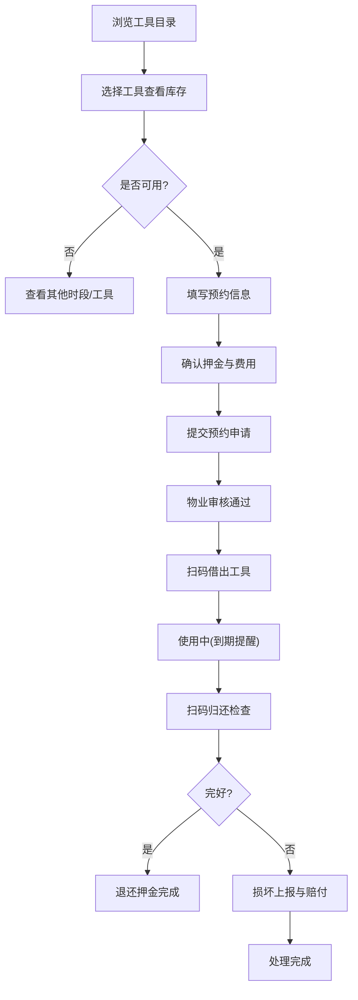
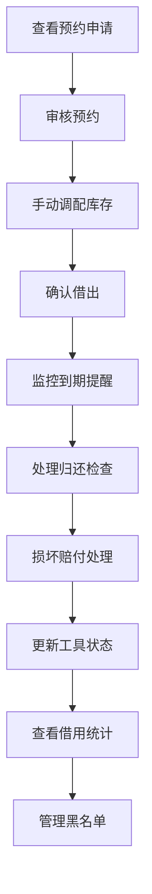

## 1. 产品概述
社区工具借用平台是面向社区居民与物业前台的共享工具管理系统，解决电钻、梯子、手推车等常用工具登记混乱、追踪困难的问题。通过数字化管理，实现工具预约、借还、赔偿全流程闭环，提升社区服务效率与居民体验。

## 2. 核心功能

### 2.1 用户角色
| 角色 | 注册方式 | 核心权限 |
|------|----------|----------|
| 社区居民 | 房号+手机号实名认证 | 浏览工具、提交预约、扫码借还、损坏上报、查看个人记录 |
| 物业前台 | 管理员账号 | 全量工具管理、预约审核、手动调配、借还操作、数据统计、黑名单管理 |

### 2.2 功能模块
1. **首页**：快捷入口、热门工具、公告通知、借用统计
2. **工具目录**：按楼栋/分类浏览、库存查询、可借时段查看
3. **预约页**：预约表单、时段选择、押金说明、提交申请
4. **借还记录页**：扫码借出、扫码归还、损坏登记、赔付处理
5. **个人中心**：历史借用、押金记录、赔付记录、黑名单状态、个人信息

### 2.3 页面详情
| 页面名称 | 模块名称 | 功能描述 |
|----------|----------|----------|
| 首页 | 快捷导航区 | 一键直达借还、预约、目录、我的记录 |
| 首页 | 热门工具展示 | 展示被借频次最高的Top 5工具 |
| 首页 | 公告通知区 | 物业发布的借用规则、常见问题、重要通知 |
| 首页 | 借用概览 | 显示当前在借、待归还、即将到期数量 |
| 工具目录 | 分类筛选 | 按工具类型（电动/手动/清洁/搬运）筛选 |
| 工具目录 | 楼栋筛选 | 按存放楼栋筛选就近可用工具 |
| 工具目录 | 工具卡片 | 展示图片、名称、库存、可借状态、日租金、押金 |
| 工具目录 | 库存详情 | 查看具体存放位置、可借时段表、维护状态 |
| 预约页 | 预约表单 | 选择工具、借用日期、归还日期、借用事由 |
| 预约页 | 时段选择器 | 日历视图展示可借/已预约时段，避免冲突 |
| 预约页 | 费用计算 | 实时计算押金、租金总额 |
| 预约页 | 预约提交 | 生成预约单号，发送确认通知 |
| 借还记录页 | 扫码借出 | 扫描工具二维码确认借出，更新库存状态 |
| 借还记录页 | 扫码归还 | 扫描二维码检查完好性，确认归还，退还押金 |
| 借还记录页 | 损坏上报 | 拍照上传、描述损坏程度、预估赔偿金额 |
| 借还记录页 | 记录列表 | 全部预约/借用记录，支持状态筛选 |
| 个人中心 | 历史借用 | 分页展示个人所有借还记录及状态 |
| 个人中心 | 押金记录 | 押金缴纳、退还明细 |
| 个人中心 | 赔付记录 | 损坏赔偿的费用明细 |
| 个人中心 | 黑名单状态 | 显示是否受限及受限原因、解除时间 |
| 个人中心 | 角色切换 | 物业人员可切换至管理后台视图 |

## 3. 核心流程

### 3.1 居民借用流程

### 3.2 物业管理流程

## 4. 用户界面设计

### 4.1 设计风格
- **主色调**：深蓝色(#165DFF)代表专业可信赖，辅助色为橙色(#FF7D00)用于操作按钮强调
- **中性色**：以深灰(#1D2129)、中灰(#4E5969)、浅灰(#C9CDD4)、极浅灰(#F2F3F5)构建清晰的信息层级
- **按钮风格**：直角微圆角(4px)，主按钮填充色+白字，次按钮描边+主色字，操作反馈明显
- **字体**："Noto Sans SC" 中文无衬线字体，标题18px加粗，正文14px常规，辅助文字12px浅灰
- **布局风格**：顶部固定导航栏+左侧分类栏(工具目录页)+主内容区的卡片式布局
- **图标风格**：线性图标为主，关键操作使用面性图标区分，保持统一24px尺寸

### 4.2 页面设计概述
| 页面名称 | 模块名称 | UI元素 |
|----------|----------|--------|
| 首页 | 快捷导航 | 4个大图标卡片网格，悬浮上浮效果 |
| 首页 | 公告栏 | 横向滚动公告条，带喇叭图标 |
| 首页 | 热门工具 | 横向滑动卡片列表，显示借用次数徽章 |
| 首页 | 我的概览 | 3个数字卡片并列展示在借/待还/即将到期 |
| 工具目录 | 筛选栏 | 分类标签横向排列，楼栋下拉选择，搜索框 |
| 工具目录 | 工具列表 | 响应式卡片网格，2-4列自适应，状态标签角标 |
| 工具目录 | 详情弹窗 | 右侧滑入抽屉，展示完整信息与预约按钮 |
| 预约页 | 日期选择 | 日历组件，已预约日期灰显禁用，可借日期高亮 |
| 预约页 | 时段选择 | 上午/下午/晚上时段块，点击选中高亮 |
| 预约页 | 费用明细 | 固定底部栏，实时更新金额 |
| 借还记录页 | 扫码区 | 大尺寸扫码框模拟，支持手动输入编号 |
| 借还记录页 | 状态标签 | 待审核/已通过/借用中/已归还/已逾期/已赔付 六种状态 |
| 借还记录页 | 记录列表 | 列表项左对齐日期，右对齐状态，中间核心信息 |
| 个人中心 | 用户信息 | 头像+姓名+房号+角色标签 |
| 个人中心 | 功能菜单 | 列表式菜单，箭头指向，分组展示 |
| 个人中心 | 统计卡片 | 累计借用次数、累计节省金额等数据 |

### 4.3 响应式设计
- **桌面优先**：以1440px宽度为基准设计，12栅格系统
- **平板适配**：1024px以下调整为2列卡片布局，侧边栏可折叠
- **手机适配**：768px以下单列布局，底部Tab导航替代顶部菜单
- **触控优化**：按钮最小高度44px，点击区域8px间距

### 4.4 微交互与动画
- 页面加载：内容区域淡入(0.3s ease-out)，导航元素依次延迟出现
- 卡片悬浮：上浮4px+阴影加深，0.2s过渡
- 按钮点击：缩放至95%再回弹，提供明确反馈
- 状态切换：标签颜色渐变过渡，避免突兀变化
- 弹窗出现：从底部滑入+淡入，0.25s动画
