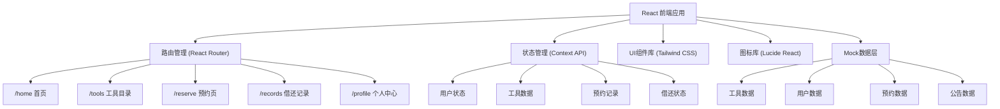
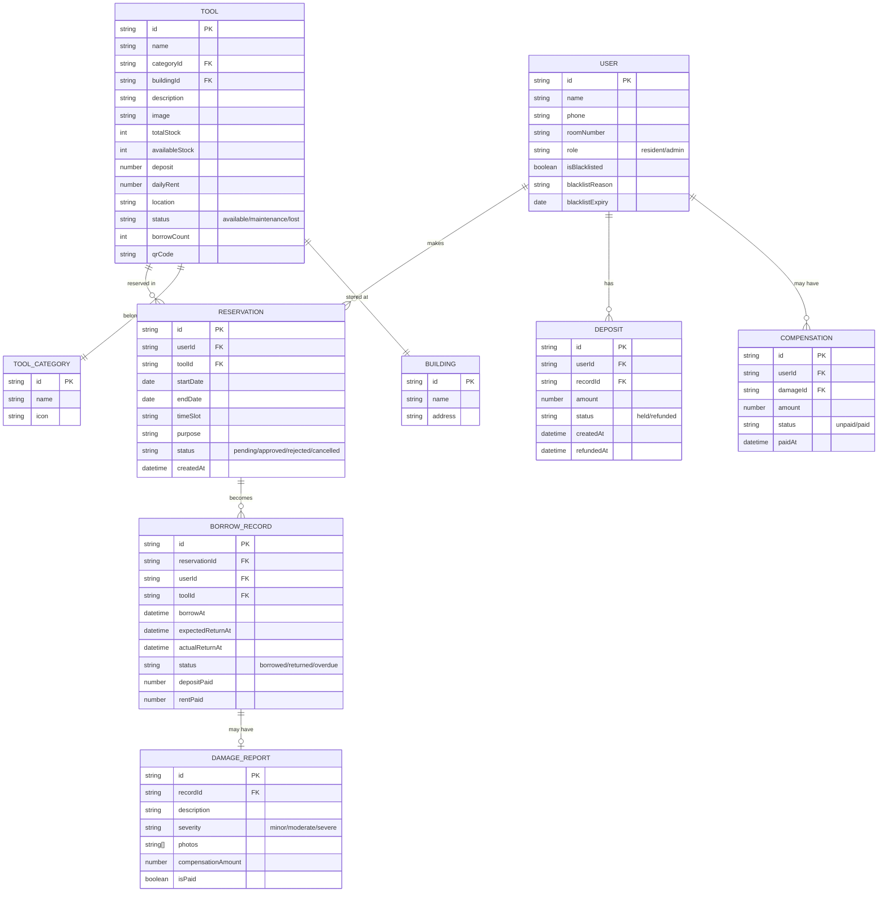

## 1. 架构设计



## 2. 技术描述

- **前端框架**：React@18.2.0 + TypeScript
- **构建工具**：Vite@5.0.0
- **样式方案**：Tailwind CSS@3.4.0
- **路由管理**：React Router DOM@6.20.0
- **图标库**：Lucide React@0.294.0
- **后端服务**：无后端，使用Mock数据模拟
- **数据持久化**：LocalStorage 存储用户操作记录

## 3. 目录结构

```
src/
├── assets/              # 静态资源
│   └── images/          # 工具图片、图标等
├── components/          # 公共组件
│   ├── Layout/          # 布局组件
│   │   ├── Header.tsx
│   │   ├── Footer.tsx
│   │   └── Navigation.tsx
│   ├── common/          # 通用组件
│   │   ├── Button.tsx
│   │   ├── Card.tsx
│   │   ├── Modal.tsx
│   │   ├── Badge.tsx
│   │   ├── Tabs.tsx
│   │   └── Input.tsx
│   └── features/        # 业务组件
│       ├── ToolCard.tsx
│       ├── Calendar.tsx
│       ├── QRCodeScanner.tsx
│       └── StatusTag.tsx
├── pages/               # 页面组件
│   ├── Home.tsx
│   ├── ToolDirectory.tsx
│   ├── Reservation.tsx
│   ├── BorrowRecords.tsx
│   └── Profile.tsx
├── context/             # 状态管理
│   ├── UserContext.tsx
│   ├── ToolContext.tsx
│   └── ReservationContext.tsx
├── data/                # Mock数据
│   ├── tools.ts
│   ├── users.ts
│   ├── reservations.ts
│   └── announcements.ts
├── types/               # TypeScript类型定义
│   ├── index.ts
│   ├── tool.ts
│   ├── user.ts
│   └── reservation.ts
├── utils/               # 工具函数
│   ├── date.ts
│   ├── storage.ts
│   └── validator.ts
├── hooks/               # 自定义Hooks
│   ├── useTools.ts
│   ├── useReservation.ts
│   └── useUser.ts
├── App.tsx
├── main.tsx
└── index.css
```

## 4. 路由定义

| 路由 | 页面 | 权限 | 说明 |
|------|------|------|------|
| /home | 首页 | 所有用户 | 快捷导航、热门工具、公告、借用概览 |
| /tools | 工具目录 | 所有用户 | 工具列表、筛选、详情查看 |
| /reserve | 预约页 | 登录用户 | 选择工具、日期时段、提交预约 |
| /reserve/:toolId | 预约指定工具 | 登录用户 | 带工具参数的预约表单 |
| /records | 借还记录 | 所有用户 | 扫码借还、记录列表、损坏上报 |
| /profile | 个人中心 | 登录用户 | 个人信息、历史记录、押金赔付、黑名单 |

## 5. 核心数据模型

### 5.1 数据模型ER图



### 5.2 核心数据结构定义

```typescript
// 用户类型
interface User {
  id: string;
  name: string;
  phone: string;
  roomNumber: string;
  role: 'resident' | 'admin';
  avatar?: string;
  isBlacklisted: boolean;
  blacklistReason?: string;
  blacklistExpiry?: string;
}

// 工具类型
interface Tool {
  id: string;
  name: string;
  categoryId: string;
  categoryName: string;
  buildingId: string;
  buildingName: string;
  description: string;
  image: string;
  totalStock: number;
  availableStock: number;
  deposit: number;
  dailyRent: number;
  location: string;
  status: 'available' | 'maintenance' | 'lost';
  borrowCount: number;
  qrCode: string;
  specifications?: string[];
  usageNotes?: string[];
}

// 预约记录
interface Reservation {
  id: string;
  userId: string;
  userName: string;
  toolId: string;
  toolName: string;
  toolImage: string;
  startDate: string;
  endDate: string;
  timeSlot: 'morning' | 'afternoon' | 'evening' | 'fullday';
  purpose: string;
  status: 'pending' | 'approved' | 'rejected' | 'cancelled';
  totalDeposit: number;
  totalRent: number;
  createdAt: string;
  approvedAt?: string;
  rejectedReason?: string;
}

// 借还记录
interface BorrowRecord {
  id: string;
  reservationId?: string;
  userId: string;
  userName: string;
  roomNumber: string;
  toolId: string;
  toolName: string;
  toolImage: string;
  borrowAt: string;
  expectedReturnAt: string;
  actualReturnAt?: string;
  status: 'borrowed' | 'returned' | 'overdue';
  depositPaid: number;
  rentPaid: number;
  damageReport?: DamageReport;
}

// 损坏上报
interface DamageReport {
  id: string;
  recordId: string;
  description: string;
  severity: 'minor' | 'moderate' | 'severe';
  photos: string[];
  compensationAmount: number;
  isPaid: boolean;
  reportedAt: string;
}

// 公告
interface Announcement {
  id: string;
  title: string;
  content: string;
  type: 'notice' | 'faq' | 'rule';
  priority: 'normal' | 'important';
  createdAt: string;
  expiresAt?: string;
}
```

### 5.3 Mock数据初始化

```typescript
// 楼栋数据
export const buildings = [
  { id: 'b1', name: '1号楼', address: '小区东门北侧' },
  { id: 'b2', name: '2号楼', address: '小区东门南侧' },
  { id: 'b3', name: '3号楼', address: '小区中心花园西侧' },
  { id: 'b4', name: '4号楼', address: '小区西门北侧' },
  { id: 'b5', name: '5号楼', address: '物业服务中心' },
];

// 工具分类
export const categories = [
  { id: 'c1', name: '电动工具', icon: 'zap' },
  { id: 'c2', name: '手动工具', icon: 'wrench' },
  { id: 'c3', name: '清洁工具', icon: 'spray-can' },
  { id: 'c4', name: '搬运工具', icon: 'truck' },
  { id: 'c5', name: '测量工具', icon: 'ruler' },
];

// 工具数据(示例)
export const tools = [
  {
    id: 't1',
    name: '博世电钻',
    categoryId: 'c1',
    categoryName: '电动工具',
    buildingId: 'b5',
    buildingName: '5号楼',
    description: '家用多功能电钻，可钻墙、钻木、拧螺丝',
    image: 'https://trae-api-cn.mchost.guru/api/ide/v1/text_to_image?prompt=bosch%20electric%20drill%20power%20tool%20on%20white%20background&image_size=square',
    totalStock: 3,
    availableStock: 2,
    deposit: 200,
    dailyRent: 15,
    location: '物业服务中心工具房',
    status: 'available',
    borrowCount: 128,
    qrCode: 'TOOL-T1-001',
    specifications: ['电压: 18V', '最大扭矩: 50Nm', '夹头范围: 1-13mm'],
    usageNotes: ['使用前请检查电池电量', '钻孔时请佩戴护目镜', '禁止用于金属钻孔'],
  },
  // ...更多工具数据
];
```

## 6. 核心功能实现思路

### 6.1 工具筛选与浏览
- 使用React状态管理分类、楼栋、搜索关键词的筛选条件
- 工具卡片展示库存状态，根据`availableStock`显示不同颜色标签
- 点击工具卡片打开右侧抽屉展示详情

### 6.2 预约系统
- 日历组件展示可借日期，已预约日期灰显
- 时段选择支持上午/下午/晚上/全天
- 实时计算押金=工具押金，租金=日租金×借用天数
- 提交预约后更新该工具对应日期的库存状态

### 6.3 扫码借还
- 模拟扫码功能，支持手动输入工具编号
- 借出时检查用户黑名单状态、押金余额
- 归还时检查工具状态，如有损坏引导进入赔偿流程

### 6.4 到期提醒
- 使用`useEffect`定时器检查即将到期(24小时内)和已逾期的借用记录
- 桌面通知+页面内红点提示

### 6.5 黑名单机制
- 用户逾期超过3天自动加入黑名单
- 物业管理员可手动添加/解除黑名单
- 黑名单用户无法提交新预约

### 6.6 数据统计
- 热门工具：按`borrowCount`排序取Top 5
- 借用统计：计算当前在借、待归还、即将到期数量
- 个人统计：累计借用次数、节省金额(对比购买成本)
